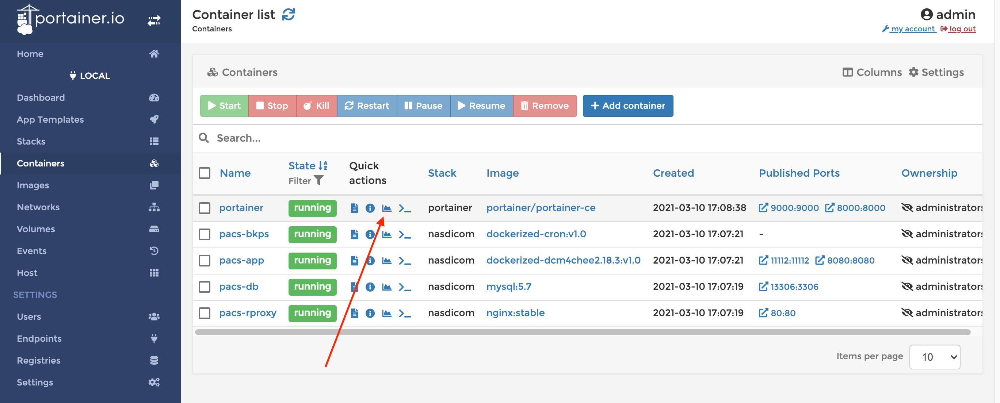
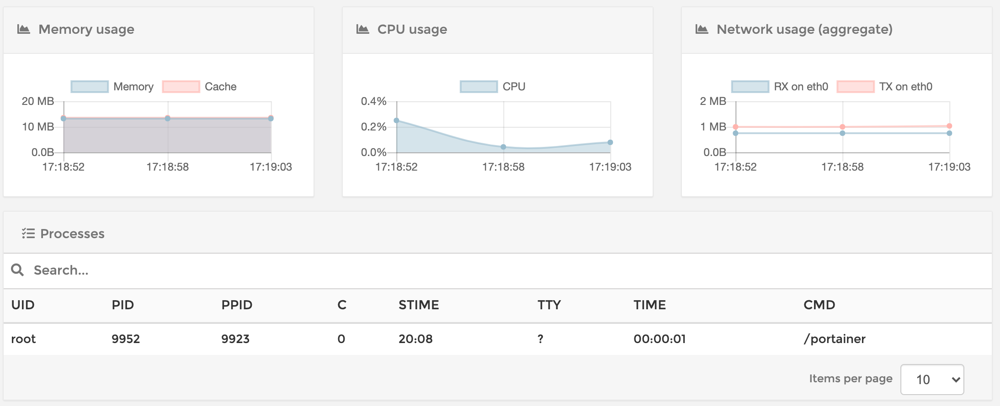
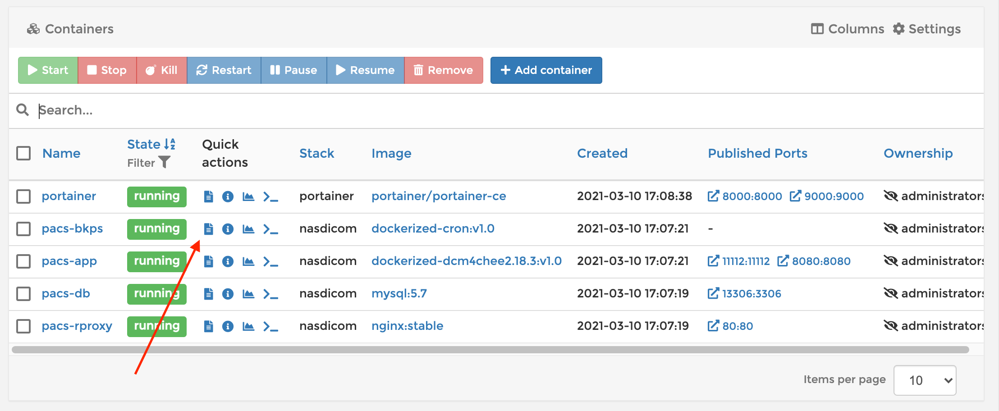
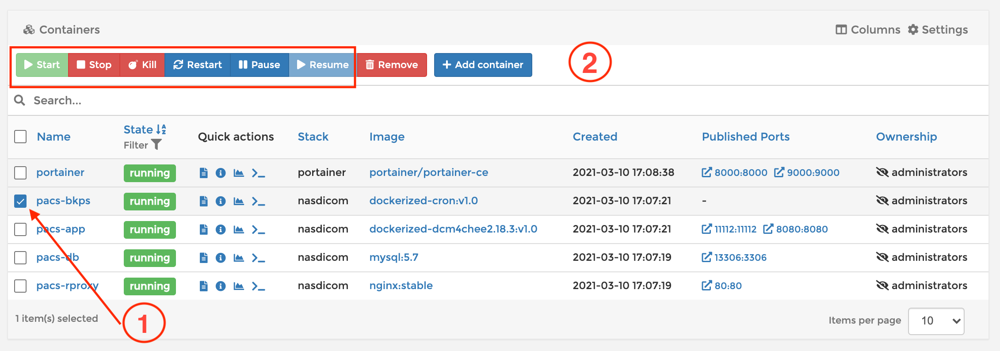

# Soporte Nivel 1 nasdicom sobre Synology


## Acceso a nasdicom

Hay **2** formas de acceder a nasdicom mediante **CLI** y **WEB**. Existe una tercera forma de acceso por GUI del DSM la cual desaconsejamos. Hay varios reportes de fallas en ella, lo que puede causar una mala comprensión del estado actual y operar de esta forma puede estropear la instalación. 

### Acceso desde CLI

Para esto solo necesitamos un cliente ssh y las credenciales.

```bash
ssh usuario@IP_NAS
```

### Acceso desde WEB

La administración se hace con [portainer.io](https://www.portainer.io/). Desde un Navegador web accedemos a https://IP_NAS:9000 e ingresamos las credenciales.

##  Tareas 

### Revisar los contenedores creados y sus estados (up, exit, etc)

Todos los contenedores nombrados como **`pacs-*`** deben estar con **STATUS UP**. Los contenedores indispensables son **`pacs-app`** y **`pacs-db`**. En el caso que `pacs-rproxy` y `pacs-cron` no existan o estén apagados significa que nasdicom está funcionando con funciones limitadas. Es decir sin proxy reverso ni tareas programadas. 

- CLI

  ```bash
  sudo docker ps -a
  ```

  ```bash
  CONTAINER ID    IMAGE               COMMAND                  CREATED        STATUS        PORTS             NAMES
  bab42e1c5a97    portainer/port...   "/portainer"             4 hours ago    Up 4 hours    0.0.0.0:8000...   portainer
  96aa522797dd    dockerized-dcm...   "./init_wrapper_scri…"   16 hours ago   Up 16 hours   0.0.0.0:8080...   pacs-app
  0095481e4e91    dockerized-cro...   "/usr/sbin/cron -f"      16 hours ago   Up 16 hours                     pacs-bkps
  7ee2db02a1af    mysql:5.7           "docker-entrypoint.s…"   16 hours ago   Up 16 hours   33060/tcp, 0....  pacs-db
  773eff04e1b1    nginx:stable        "/docker-entrypoint.…"   16 hours ago   Up 16 hours   0.0.0.0:108...    pacs-proxy           
  ```

- Web

  

  

### Monitorear los recursos en uso

Ver los contenedores y el uso de CPU / Memoria / Red  actual.

- CLI

  ```
  sudo docker stats
  ```

  ```
  CONTAINER ID        NAME                CPU %               MEM USAGE / LIMIT     MEM %               NET I/O             BLOCK I/O           PIDS
  bab42e1c5a97        portainer           0.00%               9.598MiB / 31.19GiB   0.03%               556kB / 1.19MB      0B / 0B             0
  96aa522797dd        pacs-app            89.53%              2.428GiB / 31.19GiB   7.79%               10.7GB / 34.3GB     0B / 0B             0
  0095481e4e91        pacs-bkps           0.00%               196KiB / 31.19GiB     0.00%               4.34kB / 0B         0B / 0B             0
  7ee2db02a1af        pacs-db             0.04%               386.2MiB / 31.19GiB   1.21%               369MB / 1.01GB      0B / 0B             0
  773eff04e1b1        pacs-rproxy         0.00%               1.484MiB / 31.19GiB   0.00%               54.4MB / 54.4MB     0B / 0B             0
  ```

- Web

  

  

  

### Ver logs de un contenedor.

Permite ver el logs de los contenedores para monitorear el estado de los mismos.

- CLI

  El parámetro `-f` es para ver el logo en vivo. 

  ```bash
  sudo docker logs -f nombre_contenedor
  ```

- WEB



### Apagar, prender y reiniciar un contenedor

Ante cualquier comportamiento extraño de un contenedor lo primero 2do a probar es reiniciarlo (siendo lo primero revisar sus logs). Si bien los contenedores son efímeros , para este nivel de soporte solo optamos por operar con los ya creados. Las tareas de borrar y crear nuevos contenedores quedan para un soporte de nivel superior.

- CLI

  Apagar

  ```bash
  sudo docker stop nombre_contenedor
  ```

  Prender

  ```bash
  sudo docker start nombre_contenedor
  ```

  Reiniciar 

  ```bash
  sudo docker restart nombre_contenedor
  ```

- Web

  


## Respaldos

Los respaldos son almacenados en el **volumen tipo bind** definido en el docker-compose.yml servicio backups 

```yaml
backups:
		...
		volumes:
				...
				# Directorio donde almacenar los respaldos (host docker)
				- ./data/respaldos:/data_dst
```

En este ejemplo y por defecto en nasdicom los respaldos se almacenan en el mismo equipo en `./data/respaldos`. Es muy recomendable NO se guarden aquí dado que se falla el equipo se pierde el sistema y los respaldos. Para ello la opción que se maneja aquí es montar una unidad compartida NFS sobre la carpeta `./data/respaldos`. De está forma  sin modificar la configuración ya estamos respaldando los datos en otro equipo.

Para mas información de como montar un recurso compartido NFS en Synology: [https://www.synology.com/en-global/knowledgebase/DSM/help/FileStation/mountremotevolume](https://www.synology.com/en-global/knowledgebase/DSM/help/FileStation/mountremotevolume)

